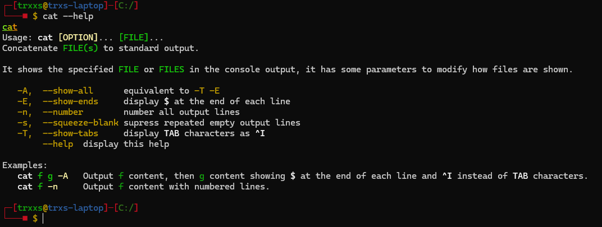

% FORMATO DE ARCHIVOS DE DESCRIPCION DE COMANDOS (.comm)
% Sergio Benito
% Noviembre, 2024

## 0. Introduccion

Un archivo *.comm* o un archivo de descripcion de comandos es un tipo de archivo que permite a los comandos de nuestro programa **FAT** acceder a datos clave para su correcta representacion.  
A la hora de ejecutar un comando con la flag `--help`, el comando mostara ordenadamente sus atributos los cuales han sido sacados y formateados desde su correspondiente *.comm*.  
De esta manera sera mas sencillo tener ese texto en archivos separados en vez de hard codearlo dentro de nuestro programa.  
Los archivos *.comm* se encontraran en la carpeta **commands**, y deberan tener el nombre de el comando para el que sirvan.  
El formato de estos archivos es muy simple pero se debera seguir rigurosamente para evitar excepciones del codigo.  
En este archivo se encuenta la guia completa al formateado de archivos *.comm* con ejemplos reales, sin embargo, tambien se podran consultar los archivos existentes que ya se encuentren completos para asegurar que esten correctamente implementados.

> **[!NOTE]** Los archivos .comm deberan ser escritos en ingles.

## 1. Secciones

Los archivos *.comm* constan de 6 secciones, **3 obligatorias y 3 opcionales**  
Las secciones comienzan con un titulo en mayusculas envuelto en caracteres *'#'*

> Ej: `#NAME#`  

- Obligatorias
    * `#NAME#`
    * `#FORMAT#`
    * `#DESCRIPTION#`  
- Opcionales
    * `#EXPLANATION#`
    * `#OPTIONS#`
    * `#NOTES#`

## 2. Comentarios

Los comentarios se realizan comenzando una linea con *'##'*  
Si en una misma linea hay texto y despues *'##'*, todo lo que haya detras se interpretara como comentario.

> Ej: `##This is a commentary.`

Cualquier cosa que escribas en la misma linea detras de '##' no sera procesada por el formateador de texto.

## 3. Formato de texto

El formato de texto lo maneja la biblioteca [Crayon](https://github.com/riezebosch/crayon).  
El texto admite colores y decoraciones.

### Colores

El texto admite el formato con distintos colores.  
Para poner color a un segmento de texto se pondra entre las etiquetas `<color=COLOR>` y `</color>`.  

> Ej: `<color=RED>**Este texto esta en rojo</color>`

Los colores disponibles son:

| COLOR    	| CODIGO                	|
|----------	|-----------------------	|
| Negro    	| `<color=BLACK><\/color>` 	|
| Rojo     	| `<color=RED><\/color>`    |
| Verde    	| `<color=GREEN><\/color>` 	|
| Amarillo 	| `<color=YELLOW><\/color>`	|
| Azul     	| `<color=BLUE><\/color>`   |
| Magenta  	| `<color=MAGENTA><\/color>`|
| Cyan     	| `<color=CYAN><\/color>`  	|
| Blanco   	| `<color=WHITE><\/color>` 	|

Ademas de esto se puede especificar un codigo rgb para un color con la etiqueta `color=RGB(r, g, b)`

> Ej: `<color=RGB(0,0,255)>Este texto esta en azul</color>`

### Decoraciones

Las decoraciones para el texto disponibles son:

| DECORACION 	| CODIGO                	|
|------------	|-----------------------	|
| Negrita    	| `<b></b>`             	|
| Suave      	| `<d></d>`             	|
| Subrayado  	| `<u></u>`             	|
| Invertido  	| `<r></r>`             	|
| Arcoiris   	| `<rainbow></rainbow>` 	|

La etiqueta `<rainbow>` admite la opcion `displacement` la cual indica en que color empezar el arcoiris, para obtener un efecto de arcoiris diagonal en titulos *ASCII*.  
La sintaxis seria de la manera `<rainbow displacement=NUM>` donde *NUM* corresponde al numero de colores que ese texto se va a saltar para empezar por otro color.

**Un ejemplo de uso seria el siguiente:**

~~~~~~~~~~~~~comm
<rainbow> ________ ___  ___       _______           ________  ___       ___       ________  ________  ________  _________  ___  ________  ________           _________  ________  ________  ___       _______      </rainbow>
<rainbow displacement=2>|\\  _____\\\\  \\|\\  \\     |\\  ___ \\         |\\   __  \\|\\  \\     |\\  \\     |\\   __  \\|\\   ____\\|\\   __  \\|\\___   ___\\\\  \\|\\   __  \\|\\   ___  \\        |\\___   ___\\\\   __  \\|\\   __  \\|\\  \\     |\\  ___ \\     </rainbow>
<rainbow displacement=4>\\ \\  \\__/\\ \\  \\ \\  \\    \\ \\   __/|        \\ \\  \\|\\  \\ \\  \\    \\ \\  \\    \\ \\  \\|\\  \\ \\  \\___|\\ \\  \\|\\  \\|___ \\  \\_\\ \\  \\ \\  \\|\\  \\ \\  \\\\ \\  \\       \\|___ \\  \\_\\ \\  \\|\\  \\ \\  \\|\\ /\\ \\  \\    \\ \\   __/|    </rainbow>
<rainbow displacement=6> \\ \\   __\\\\ \\  \\ \\  \\    \\ \\  \\_|/__       \\ \\   __  \\ \\  \\    \\ \\  \\    \\ \\  \\\\\\  \\ \\  \\    \\ \\   __  \\   \\ \\  \\ \\ \\  \\ \\  \\\\\\  \\ \\  \\\\ \\  \\           \\ \\  \\ \\ \\   __  \\ \\   __  \\ \\  \\    \\ \\  \\_|/__  </rainbow>
<rainbow displacement=8>  \\ \\  \\_| \\ \\  \\ \\  \\____\\ \\  \\_|\\ \\       \\ \\  \\ \\  \\ \\  \\____\\ \\  \\____\\ \\  \\\\\\  \\ \\  \\____\\ \\  \\ \\  \\   \\ \\  \\ \\ \\  \\ \\  \\\\\\  \\ \\  \\\\ \\  \\           \\ \\  \\ \\ \\  \\ \\  \\ \\  \\|\\  \\ \\  \\____\\ \\  \\_|\\ \\ </rainbow>
<rainbow displacement=10>   \\ \\__\\   \\ \\__\\ \\_______\\ \\_______\\       \\ \\__\\ \\__\\ \\_______\\ \\_______\\ \\_______\\ \\_______\\ \\__\\ \\__\\   \\ \\__\\ \\ \\__\\ \\_______\\ \\__\\\\ \\__\\           \\ \\__\\ \\ \\__\\ \\__\\ \\_______\\ \\_______\\ \\_______\\</rainbow>
<rainbow displacement=12>    \\|__|    \\|__|\\|_______|\\|_______|        \\|__|\\|__|\\|_______|\\|_______|\\|_______|\\|_______|\\|__|\\|__|    \\|__|  \\|__|\\|_______|\\|__| \\|__|            \\|__|  \\|__|\\|__|\\|_______|\\|_______|\\|_______|</rainbow>
~~~~~~~~~~~~~

**Y el resultado se traduciria a:**

> **[!NOTE]**  
>  
>El efecto arcoiris le da un color del arcoiris a cada letra que haya dentro de las etiquetas, no tiene animacion.  
>A su vez, la etiqueta `<color>` no funciona junto con la etiqueta `<rainbow>` por lo que rainbow modificara el color establecido.  
>Con la etiqueta `<rainbow>` solo funcionan las etiquetas `<d>`, `<u>` y `</r>`.

## 4. Caracteres especiales

### Tabuladores

Los tabuladores se introducen poniendo la etiqueta `<tab>` la cual se reemplazara por un tabulador en el formateador.

> Ej:  
>  
> `<tab>Este texto esta tabulado una vez`  
> `<tab><tab>Este texto esta tabulado dos veces`

### Saltos de linea

Los saltos de linea se introducen poniendo la etiqueta ` ` y se trata de manera similar al tabulador.

> **[!NOTE]** Cada linea del documento *.comm* tambien se trata como independiente y se le incluira un salto de linea al final sin necesidad de usar la etiqueta correspondiente.

## 5. Caracteres ilegales

No se pueden usar los caracteres `"<"` y `">"` ya que el formateador los confunde con etiquetas, por lo cual para que se interpreten correctamente hay que poner `"#<#"` y `"#>#"` respectivamente.

## 6. Ejemplo (cat)

### Codigo:

El siguiente codigo se encuentra en el archivo `bin/Debug/net6.0/commands/cat.comm` del proyecto, es un ejemplo de como formatear un archivo .comm para que muestre correctamente su informacion.

~~~~~~~~~~comm
##mandatory
#NAME#
<rainbow><u>cat</u></rainbow>
#FORMAT#
Usage: <b>cat <color=YELLOW>[OPTION]</color></b>... <b><color=GREEN>[FILE]</color></b>...
#DESCRIPTION#
Concatenate <color=GREEN><b>FILE(s)</b></color> to standard output.
##optional
#EXPLANATION#
It shows the specified <color=GREEN><b>FILE</b></color> or <color=GREEN><b>FILES</b></color> in the console output, it has some parameters to modify how files are shown.
#OPTIONS#
   <color=YELLOW>-A,<tab>--show-all</color><tab>equivalent to <color=YELLOW>-T -E</color>
   <color=YELLOW>-E,<tab>--show-ends</color><tab>display <b>$</b> at the end of each line
   <color=YELLOW>-n,<tab>--number</color><tab>number all output lines
   <color=YELLOW>-s,<tab>--squeeze-blank</color><tab>supress repeated empty output lines
   <color=YELLOW>-T,<tab>--show-tabs</color><tab>display <b>TAB</b> characters as <b>^I</b>
   <tab><color=YELLOW>--help</color><tab>display this help
#NOTES#
Examples:
   <b>cat <color=GREEN>f g</color> <color=YELLOW>-A</color></b><tab>Output <color=GREEN>f</color> content, then <color=GREEN>g</color> content showing <b>$</b> at the end of each line and <b>^I</b> instead of <b>TAB</b> characters.
   <b>cat <color=GREEN>f</color> <color=YELLOW>-n</color></b><tab>Output <color=GREEN>f</color> content with numbered lines.
~~~~~~~~~~

### Resultado:

El resultado al formatear a salida de consola este archivo, usando el comando `cat --help` es el siguiente.

